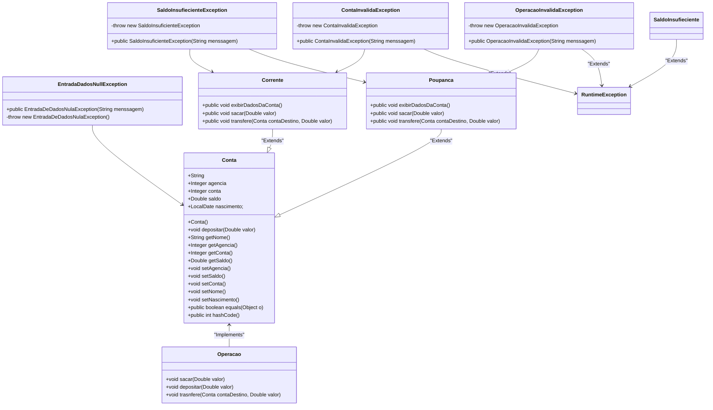

```mermaid
classDiagram
class EntradaDadosNullException{
+public EntradaDeDadosNulaException(String menssagem)
-throw new EntradaDeDadosNulaException()
}
class ContaInvalidaException{
+public ContaInvalidaException(String menssagem)
-throw new ContaInvalidaException
}
class SaldoInsufiecienteException{
+public SaldoInsuficienteException(String menssagem)
-throw new SaldoInsuficienteException
}
class OperacaoInvalidaException{
+public OperacaoInvalidaException(String menssagem)
-throw new OperacaoInvalidaException
}
class Conta {
+String
+Integer agencia
+Integer conta
+Double saldo
+LocalDate nascimento;
+Conta()
+void depositar(Double valor)
+String getNome()
+Integer getAgencia()
+Integer getConta()
+Double getSaldo()
+void setAgencia()
+void setSaldo()
+void setConta()
+void setNome()
+void setNascimento()
+public boolean equals(Object o)
+public int hashCode()
}

class Operacao {
+void sacar(Double valor)
+void depositar(Double valor)
+void trasnfere(Conta contaDestino, Double valor)
}

class Poupanca {
+public void exibirDadosDaConta()
+public void sacar(Double valor)
+public void transfere(Conta contaDestino, Double valor)
}

class Corrente {
+public void exibirDadosDaConta()
+public void sacar(Double valor)
+public void transfere(Conta contaDestino, Double valor)
}

Conta <-- Operacao : "Implements"
Poupanca --|> Conta : "Extends"
Corrente --|> Conta : "Extends"

ContaInvalidaException --> RuntimeException : "Extends"
OperacaoInvalidaException --> RuntimeException : "Extends"
SaldoInsufieciente --> RuntimeException : "Extends"

EntradaDadosNullException --> Conta
SaldoInsufiecienteException --> Poupanca
SaldoInsufiecienteException --> Corrente
OperacaoInvalidaException --> Poupanca
ContaInvalidaException --> Corrente 
```